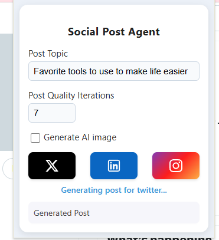
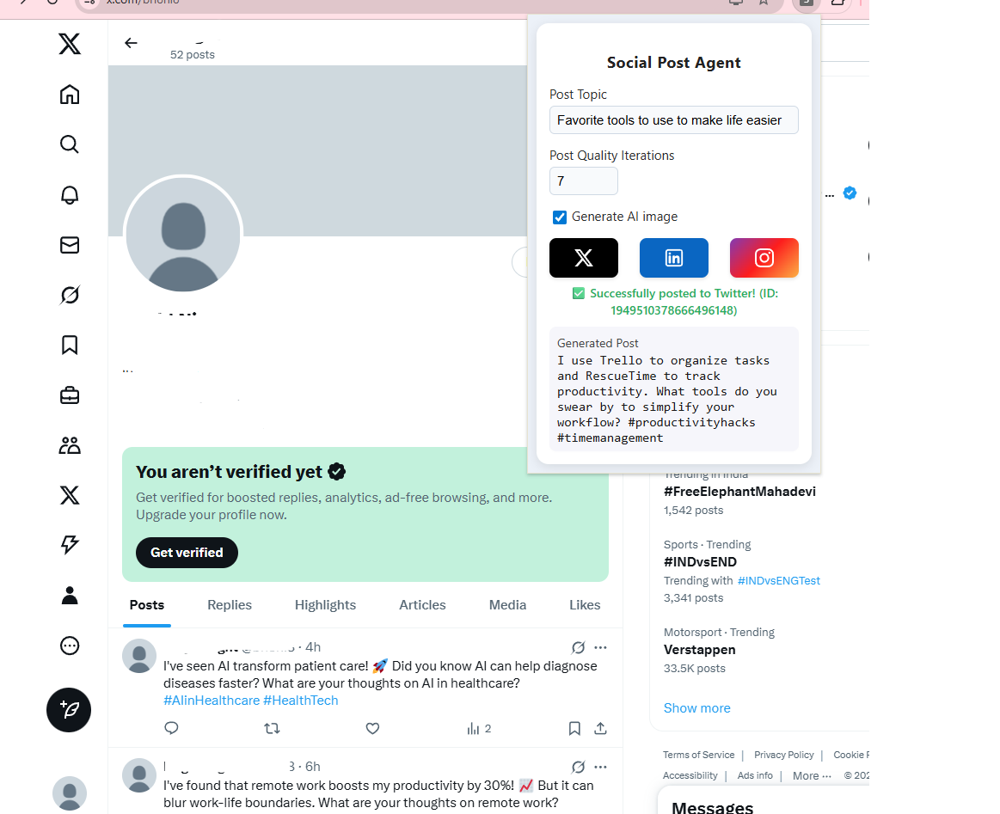
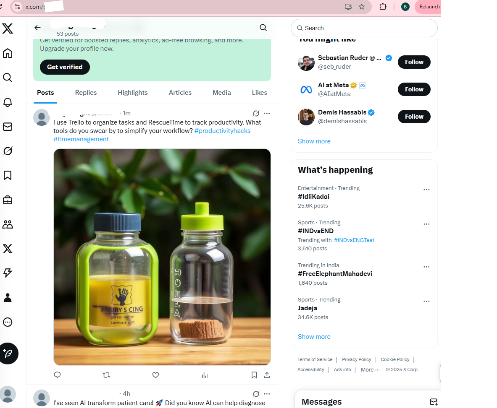
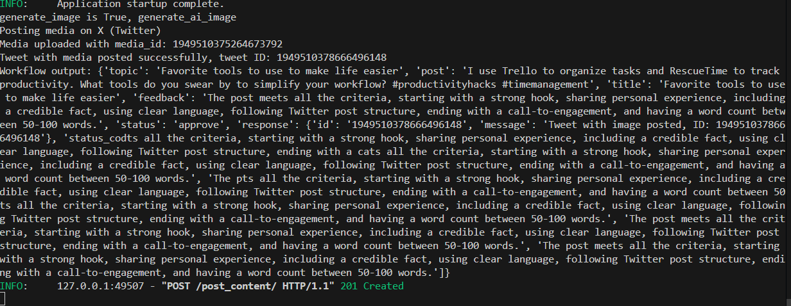
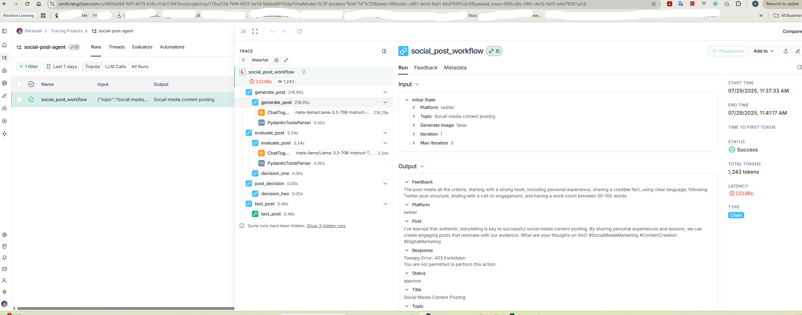

# 🚀 Social Post Agent

An intelligent AI-powered social media content generator that creates, evaluates, optimizes, and automatically posts content to Twitter (X), LinkedIn, and Instagram. Built with LangGraph, LangChain, FastAPI, and modern web technologies.



## ✨ Features

- 🤖 **AI-Powered Content Generation**: Creates platform-specific content using advanced LLM models
- 📊 **Intelligent Evaluation System**: Automatically evaluates and optimizes content for maximum engagement
- 🎨 **AI Image Generation**: Generates relevant images for your posts (optional)
- 🔄 **Multi-Platform Support**: Twitter (X), LinkedIn, and Instagram integration
- 🌐 **Browser Extension**: Chrome extension for easy content creation and posting
- 📈 **Platform-Specific Optimization**: Tailored content length and style for each platform
- 🔧 **RESTful API**: Clean FastAPI backend with comprehensive error handling

## 🎯 Platform-Specific Features

### Twitter (X)
- 📝 50-100 word posts optimized for engagement
- 🔗 Support for both text and media posts
- 💬 Focus on conversation starters and professional insights

### LinkedIn
- 📄 300-400 word professional content
- 🏢 Business-focused insights and thought leadership
- 📊 Industry trends and professional networking

### Instagram
- 📸 Image-required posts with engaging captions
- 🎨 100-150 word visual storytelling
- 📱 Community-building and authentic connection

## 🛠️ Technology Stack

**Backend:**
- **FastAPI** - Modern Python web framework
- **LangGraph** - Workflow orchestration for AI agents
- **LangChain** - LLM integration and prompt management
- **LangSmith** - Observability and monitoring for AI workflows
- **Tweepy** - Twitter API integration
- **Together** - Access language models
- **Pydantic** - Data validation and serialization
- **Python-dotenv** - Environment variable management

**Frontend:**
- **Chrome Extension** - Browser-based interface
- **Vanilla JavaScript** - Lightweight and fast
- **CSS3** - Modern styling and responsive design

**APIs & Services:**
- **Together** - Access free/open-source LLMs
- **Twitter API v2** - Tweet posting and management
- **LinkedIn API** - Professional content sharing
- **Instagram Graph API** - Visual content publishing

## 📁 Project Structure

```
social-post-agent/
├── 🤖 agent/
│   ├── __init__.py
│   ├── agent_state.py              # State management for workflows
│   ├── content_poster.py           # Platform-agnostic posting logic
│   ├── image_generator.py          # AI image generation
│   ├── langgraph_workflow.py       # Main workflow orchestration
│   ├── post_evaluator.py           # Content evaluation logic
│   ├── post_generator.py           # Content generation logic
│   ├── post_optimizer.py           # Content optimization logic
│   ├── 📝 prompts/
│   │   ├── __init__.py
│   │   ├── post_evaluation_prompts.py
│   │   ├── post_generation_prompts.py
│   │   └── post_optimization_prompts.py
│   ├── 🏗️ states/
│   │   ├── __init__.py
│   │   └── agent_state.py
│   └── 🌐 social_media/
│       ├── __init__.py
│       ├── instagram_poster.py     # Instagram API integration
│       ├── linkedin_poster.py      # LinkedIn API integration
│       └── x_twitter_poster.py     # Twitter API integration
├── 🧠 models/
│   └── models.py                   # LLM model configurations
├── 📓 notebook/
│   └── social_poster_agent.ipynb  # Development and testing notebook
├── 🎨 ui/                          # Chrome Extension Files
│   ├── manifest.json              # Extension configuration
│   ├── popup.css                  # Extension styling
│   ├── popup.html                 # Extension interface
│   ├── popup.js                   # Extension logic
│   └── 🎭 logo/
│       ├── instagram-logo.svg
│       ├── linkedin-logo.svg
│       └── x_twitter-logo.svg
├── 📄 Configuration Files
│   ├── .env                       # Environment variables (create from .env.example)
│   ├── .env.example              # Environment template
│   ├── .gitignore
│   ├── pyproject.toml            # Project metadata
│   ├── requirements.txt          # Python dependencies
│   └── uv.lock                   # Locked dependencies
├── � Documentation
│   ├── LANGSMITH_GUIDE.md        # LangSmith integration guide
│   ├── LICENSE                   # MIT License
│   └── README.md                 # Main documentation
├── � app.py                      # FastAPI server
```

## 🚀 Quick Start

### Prerequisites

- Python 3.11 or higher
- Chrome browser (for extension)
- API credentials for desired platforms

### 1. Installation

#### Option A: Using UV (Recommended)

**Windows (PowerShell):**
```bash
powershell -ExecutionPolicy ByPass -c "irm https://astral.sh/uv/install.ps1 | iex"
```

**macOS & Linux:**
```bash
curl -LsSf https://astral.sh/uv/install.sh | sh
```

**Setup Project:**
```bash
# Clone the repository
git clone https://github.com/niweshbaraj/social-post-agent.git
cd social-post-agent

# Initialize UV and create virtual environment
uv init
uv venv

# Activate virtual environment
# Windows:
.venv\Scripts\activate
# macOS/Linux:
source .venv/bin/activate

# Install dependencies
uv add -r requirements.txt

# Optional: Install Jupyter kernel for notebooks
uv add ipykernel
```

#### Option B: Using pip

```bash
# Clone and navigate
git clone https://github.com/niweshbaraj/social-post-agent.git
cd social-post-agent

# Create virtual environment
python -m venv venv

# Activate virtual environment
# Windows:
venv\Scripts\activate
# macOS/Linux:
source venv/bin/activate

# Install dependencies
pip install -r requirements.txt
```

### 2. Environment Configuration

Create a `.env` file in the project root:

```bash
cp .env.example .env
```

Edit `.env` with your API credentials:

```env
# LangSmith API (Optional - for observability and monitoring)
LANGCHAIN_API_KEY=your_langchain_api_key_here
LANGCHAIN_TRACING_V2=true
LANGCHAIN_PROJECT=social-post-agent

# OpenAI API (Required for content generation)
OPENAI_API_KEY=your_openai_api_key

# Twitter (X) API Credentials
X_ACCESS_TOKEN=your_twitter_access_token
X_ACCESS_TOKEN_SECRET=your_twitter_access_token_secret
X_API_KEY=your_twitter_api_key
X_API_SECRET=your_twitter_api_secret

# LinkedIn API Credentials (Optional)
LINKEDIN_ACCESS_TOKEN=your_linkedin_access_token
LINKEDIN_PERSON_ID=your_linkedin_person_id

# Instagram API Credentials (Optional)
INSTAGRAM_ACCESS_TOKEN=your_instagram_access_token
INSTAGRAM_BUSINESS_ACCOUNT_ID=your_instagram_business_account_id

# # Together AI API Key (for content generation)
TOGETHER_API_KEY=your_together_api_key
```

### 3. Start the Backend

```bash
# Run the FastAPI server
uvicorn app:app --reload

# Server will start at http://localhost:8000
```

### 4. Install Chrome Extension

1. Open Chrome and navigate to `chrome://extensions/`
2. Enable "Developer mode" (top right toggle)
3. Click "Load unpacked"
4. Select the `ui/` folder from the project
5. The extension will appear in your Chrome toolbar

## 🔧 API Setup Guides

### Twitter (X) API Setup

1. **Create Developer Account**
   - Visit [Twitter Developer Platform](https://developer.twitter.com/)
   - Apply for a developer account
   - Complete the application process

2. **Create Project and App**
   - Go to Developer Portal → Projects & Apps
   - Create a new project
   - Create an app within the project

3. **Configure Permissions**
   - Navigate to App Settings → User Authentication Settings
   - Click "Set Up"
   - Select "Read and write" permissions
   - Choose "Web App, Automated App or Bot"
   - Add callback URI (can use `http://localhost/` for testing)
   - Add website URL

4. **Generate API Keys**
   - Go to Keys and Tokens tab
   - Generate and save:
     - API Key
     - API Secret Key
     - Access Token
     - Access Token Secret
   - **Important:** Regenerate tokens after changing permissions

### LinkedIn API Setup

1. **Create LinkedIn App**
   - Visit [LinkedIn Developer Platform](https://www.linkedin.com/developers/)
   - Create a new app
   - Fill in required information

2. **Configure Products**
   - Add "Share on LinkedIn" product
   - Complete verification if required

3. **Get Credentials**
   - Note your Client ID and Client Secret
   - Generate access token through OAuth flow
   - Get your LinkedIn Person ID

### Instagram API Setup

1. **Facebook Developer Account**
   - Create account at [Facebook for Developers](https://developers.facebook.com/)
   - Create a new app

2. **Instagram Basic Display**
   - Add Instagram Basic Display product
   - Configure Instagram App ID

3. **Business Account**
   - Connect Instagram Business account
   - Get Business Account ID and Access Token

### 🤖 Together & ChatTogether: Free LLM Backend

This project uses [Together AI](https://www.together.ai/) to access free/open-source language models like LLaMA, Mistral, and Zephyr.

We use the `ChatTogether` wrapper from LangChain to connect to these models inside LangGraph flows.

#### Why Together?
- 💸 Free & open source models
- 🧩 Easy integration with LangChain
- 🚀 No GPU or hosting setup needed
- 🔌 Plug-and-play model switching

To use it:
1. Get a free API key from [Together](https://www.together.ai/)
2. Add it to your `.env` or environment:
   ```bash
   export TOGETHER_API_KEY=your_key_here
   ```

### 📊 LangSmith: AI Workflow Observability

This project integrates [LangSmith](https://smith.langchain.com/) for comprehensive observability and monitoring of your AI workflows.

#### 🔍 What LangSmith Provides
- **🐛 Debug**: Detailed traces of every workflow step
- **📈 Monitor**: Performance metrics and usage analytics  
- **🎯 Evaluate**: Content quality and success rates
- **⚡ Optimize**: Identify bottlenecks and improve efficiency

#### Setup LangSmith (Optional but Recommended)

1. **Get LangSmith API Key**
   - Visit [LangSmith](https://smith.langchain.com/)
   - Create account and generate API key

2. **Add to Environment**
   ```bash
   LANGCHAIN_API_KEY=your_langchain_api_key
   LANGCHAIN_TRACING_V2=true
   LANGCHAIN_PROJECT=social-post-agent
   ```

3. **View Traces**
   - Run your agent and see real-time traces
   - Monitor content generation, evaluation, and posting
   - Debug failures and optimize performance

For detailed setup instructions, see [LANGSMITH_GUIDE.md](LANGSMITH_GUIDE.md).

## 🖥️ Usage

### Using the Chrome Extension



1. **Click the extension icon** in your Chrome toolbar
2. **Enter your topic** in the text field
3. **Set optimization iterations** (1-10, default: 3)
4. **Toggle image generation** if desired
5. **Select platform** (Twitter, LinkedIn, or Instagram)
6. **Click platform button** to generate and post

- Content generation frontend view :



- Same result at terminal : 



### Using the API Directly

#### Generate and Post Content

```bash
curl -X POST "http://localhost:8000/post_content/" \
  -H "Content-Type: application/json" \
  -d '{
    "topic": "AI productivity tools",
    "max_iteration": 3,
    "generate_image": false,
    "platform": "twitter"
  }'
```

#### Response Format

```json
{
  "message": "Post created successfully",
  "data": {
    "topic": "AI productivity tools",
    "post": "Just discovered an AI tool that saved me 3 hours today! 🚀 Did you know that 73% of professionals report increased productivity with AI assistance? What's your favorite AI tool for work? #AI #productivity",
    "status_code": 201,
    "tweet_id": "1749400268220555546",
    "platform": "twitter",
    "iteration": 1,
    "feedback": "The post meets all criteria..."
  }
}
```

### API Endpoints

- `GET /` - Health check
- `POST /post_content/` - Generate and post content

## 🔧 Configuration

### Model Configuration

Edit `models/models.py` to customize AI models:

```python
# Example: Switch to different OpenAI model
generator_model = ChatOpenAI(
    model="gpt-4o-mini",  # or "gpt-3.5-turbo"
    temperature=0.7
)
```

### Platform-Specific Settings

Each platform has specific content requirements:

- **Twitter**: 50-100 words, engagement-focused
- **LinkedIn**: 300-400 words, professional value
- **Instagram**: 100-150 words, visual storytelling

## 🛠️ Development


### Development Mode

```bash
# Run with auto-reload
uvicorn app:app --reload --host 0.0.0.0 --port 8000

# Enable debug logging
export LOG_LEVEL=DEBUG
```

### Extending Platforms

To add a new social media platform:

1. Create `agent/social_media/new_platform_poster.py`
2. Add platform logic to `agent/content_poster.py`
3. Update `agent/post_generator.py` with platform-specific prompts
4. Update `agent/post_evaluator.py` with platform criteria
5. Update frontend UI to include new platform button

## 🚨 Troubleshooting

### Common Issues

**403 Forbidden Error (Twitter)**
- Verify API credentials in `.env`
- Check Twitter app has "Read and Write" permissions
- Ensure access tokens were regenerated after permission changes
- Ensure word length is under 100 words (forbides posting lengthy content for free tier)

**Content Generated but Not Posted**
- Check API credentials are valid
- Verify platform-specific permissions
- Check rate limits haven't been exceeded

**Extension Not Loading**
- Ensure `manifest.json` is valid
- Check Chrome Developer Mode is enabled
- Verify all extension files are present

**Backend Connection Failed**
- Ensure FastAPI server is running on `http://localhost:8000`
- Check CORS settings in `app.py`
- Verify firewall isn't blocking local connections

**LangSmith Traces Not Appearing**
- Check `LANGCHAIN_API_KEY` is set correctly in `.env`
- Ensure `LANGCHAIN_TRACING_V2=true`
- Verify project name in `LANGCHAIN_PROJECT`
- Check network connectivity to LangSmith servers
- See [LANGSMITH_GUIDE.md](LANGSMITH_GUIDE.md) for detailed troubleshooting

- LangSmith tracing 




## 📄 License

This project is licensed under the MIT License - see the [LICENSE](LICENSE) file for details.

## 🙏 Acknowledgments

- **LangChain** team for excellent LLM integration tools
- **FastAPI** for the modern web framework
- **Together** for powerful language models
- Social media platforms for their APIs

---

**Made with ❤️ and AI** • Star ⭐ this repo if you find it helpful!
